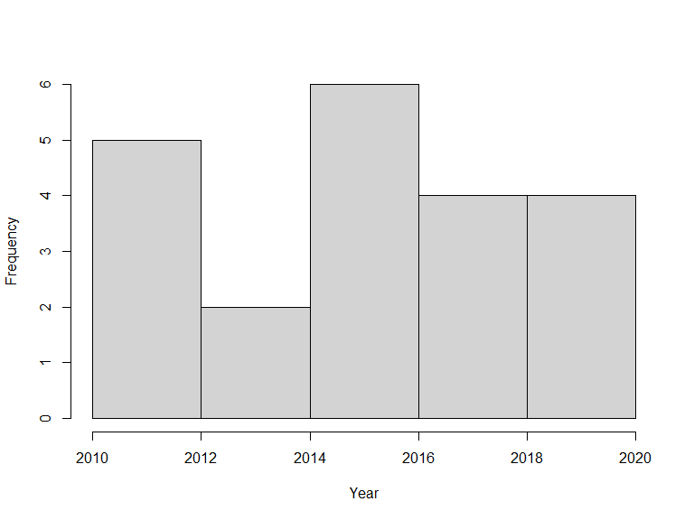

```{r setup, include = FALSE}
library(knitr)
opts_chunk$set(
  collapse = TRUE,
  comment = "#>"
)
```

Here we provide a collection of use-examples showing a range of queries that we think a typical use of the biodiversity infrastructure may want to perform. `sbdi4r2` is a wrapper for `galah` customized to interact with the SDBI implementation. `galah` is an R interface to biodiversity data hosted by the 'living atlases'; a set of organisations that share a common codebase, and act as nodes of the Global Biodiversity Information Facility ([GBIF](https://www.gbif.org)). These organisations collate and store observations of individual life forms, using the ['Darwin Core'](https://dwc.tdwg.org) data standard.

The sbdi4r2 package is primarily for accessing data. It includes some filter functions that allow you to filter prior to download. It also includes (to be soon developed) some simple summary functions, and some functions for some simple data exploration. The examples also show you how you can use the data by exploring and analyzing with help of other R packages.

Please get in contact with us if you have questions regarding the use of the sbdi4r2 package.

## Using sbdi4r2

Let's assume you have already installed the package as shown in the [main site](https://biodiversitydata-se.github.io/sbdi4r2).

Load the `sbdi4r2` package:

```{r load, eval=FALSE}
library(sbdi4r2)
sbdi_config(email = "your.email@mail.com")
```

```{r loadtrue, message=FALSE, include=FALSE}
library(sbdi4r2)
# library(galah)
sbdi_config(email = "sbdi4r-test@biodiversitydata.se")
```

Then, check that we have some additional packages that we'll use in the examples, and install them if necessary.

```{r otherpkg, message=FALSE, eval=FALSE}
to_install <- c( "dplyr", "ggplot2", "htmlTable", "lubridate", "leaflet", 
                 "maps", "mapdata", "phytools", "sf",  "tidyverse", "vegan") 
to_install <- to_install[!sapply(to_install, requireNamespace, quietly = TRUE)]
if (length(to_install) > 0)
    install.packages(to_install, repos = "http://cran.us.r-project.org")
```

## Example 1: Name searching and taxonomic trees

[](https://www.flickr.com/people/23632548@N00)

We want to look at the taxonomy of the Crested tit (*Lophophanes cristatus*), but we don't know what the correct scientific name is, so let's search for it:

```{r species, warning=FALSE, message=FALSE, eval=TRUE}
sx <- sbdi_call() |> 
        sbdi_identify("parus") |> 
        atlas_species()
sx
```

But we see that some non-birds are also returned, e.g. insects (*Neuroctenus parus*). We want to restrict the search to the family Paridae, but filter out hybrids between genus (`genus == NA`).

```{r spec_family, message=FALSE, eval=TRUE}
sx <- sbdi_call() |> 
        sbdi_identify("paridae") |> 
        atlas_species() |> 
        filter(!is.na(genus)) |> 
        as.data.frame()
sx
```

Do you find it?

We can make a taxonomic tree plot using the `phytools` package:

```{r taxtree, fig.height=6, fig.width=8, message=FALSE, eval=FALSE}
library(phytools)
## as.phylo requires the taxonomic columns to be factors
sx$genus <- as.factor(sx$genus)
sx$species_name <- as.factor(sx$species_name)
sx$vernacular_name <- as.factor(sx$vernacular_name)

## create phylo object of canonical name nested within Genus
ax <- as.phylo(~genus/species_name, data = sx)
plotTree(ax, fsize = 0.7, ftype="i") ## plot it
```


## Example 2: Get some data and work it out

Let's filter, get quality assertions, plot data on a map and save it. First let's download occurrence data for the "Sommarlånke" and view top of the data table:

```{r table_source}
library(dplyr)
library(htmlTable)

focal_spp <- search_taxa("Callitriche cophocarpa")
## or equally valid
focal_spp <- search_taxa("sommarlånke")
focal_spp$taxon_concept_id

x <- sbdi_call() |> 
  sbdi_identify("Callitriche cophocarpa") |>
  atlas_occurrences()

x |> 
  pull(dataResourceName) |> 
  table() |> 
  as.data.frame() |> 
  rename("Source" = Var1) |> 
  htmlTable()
```

You can also search for a set of species simultaneously.

```{r search_couple, message=FALSE }
taxa <- c("Callitriche", "Anarrhinum")
x <- sbdi_call() |> 
  sbdi_identify(taxa) |>
  atlas_occurrences()

x |> 
  pull(dataResourceName) |> 
  table() |> 
  as.data.frame() |> 
  rename("Source" = Var1) |> 
  htmlTable()
```

### Search filters

There are different data sources. Let's assume you only need to see data from one source, e.g. Lund University Biological Museum - Botanical collection (LD), which we just happen to know its UID is "dr2" (more about how to find out this later):

```{r filters, message=FALSE}
taxa <- "Callitriche cophocarpa"
xf <- sbdi_call() |>
  sbdi_identify(taxa) |>
  filter(dataResourceUid == "dr2") |>
  atlas_occurrences()

xf |> 
  pull(dataResourceName) |> 
  table() |> 
  as.data.frame() |> 
  rename("Source" = Var1) |> 
  htmlTable()
```

### What to search for?

The package offers a function `show_all_fields()` to help you know what fields you can query. There are many such help functions, check `?show_all()`.

```{r allfields, eval= FALSE}
show_all(fields)
```

For example, in SBDI all fields starting with "cl" are spatial layers.

```{r filter_cl, message = FALSE}
show_all(fields) |> 
  filter(grepl("cl", id)) |>  
  as.data.frame() |> 
  head(10)
```

You can use the spatial layers that are available to spatially search for the indexed observations.

```{r filter_spatial, eval = FALSE}
show_all(fields) |> 
  filter(description == "Län") |> 
  as.data.frame()

xf <- sbdi_call() |> 
  sbdi_identify(taxa) |>
  filter("cl10097" == "Uppsala") |>
  atlas_occurrences()
```

Note that this is fundamentally different than filtering by `county=Uppsala` as this will search for the text `Uppsala` in the field `county`, rather than spatially matching the observations.

[TO BE DEVELOPED] Otherwise, you can search available data resources, collections (and more) using the interactive function `pick_filter`. The `pick_filter` function lets you explore data collections, spatial layers. Soon there will be more indexed fields.

Any search could be filtered by any indexed field (a.k.a. column or variable). For example, let's filter observations with coordinate uncertainty smaller than or equal to 100 m.

```{r filter_coor, eval=FALSE}
xf <- sbdi_call() |> 
  sbdi_identify(taxa) |>
  filter(coordinateUncertaintyInMeters <= 100) |>
  atlas_occurrences()
```

One could search for observations in specific years:

```{r filter_time, message=FALSE}
x2yr <- sbdi_call() |> 
  sbdi_identify(taxa) |>
  filter(year == 2010 | year == 2020) |>
  atlas_occurrences()
```

In the same way, one could search for observations *between* two years:

```{r filter_timerange, message=FALSE}
library(lubridate)
xf <- sbdi_call() |> 
  sbdi_identify(taxa) |>
  filter(year >= 2010, year <= 2020) |>
  atlas_occurrences()
```

```{r hist_years, , fig.width=8, fig.height=6, eval=FALSE}
hist(year(xf$eventDate), xlab = "Year", main = "")
```



Likewise, search conditions can be accumulated and will be treated as AND conditions:

```{r filter_month, echo=FALSE, message=FALSE, fig.width=8, fig.height=6}
xf <- sbdi_call() |> 
  sbdi_identify(taxa) |>
  filter(year >= 2010, year <= 2020,
         month >= 6, month <= 8) |>
  atlas_occurrences()
```

```{r barplot, eval=FALSE}
barplot(table(month(xf$eventDate)), xlab = "Month", main = "")
```


or, occurrences could be filtered by the basis of record (that is, how was the observation recorded):

```{r filter_bor, message=FALSE}
xbor <- sbdi_call() |> 
  sbdi_identify(taxa) |>
  filter(basisOfRecord == "PreservedSpecimen") |>
  select(basisOfRecord, group = "basic") |> 
  atlas_occurrences()
```

In this last example we introduce the use of select(). This function will control which columns you retrieve from the atlas. By default, a minimum set of columns is pre-selected. But any field you can search for can be retrieved. See more about this function `?sbdi_select()`

### Quality assertions

Data quality assertions are a suite of fields that are the result of a set of tests performed on data. We continue using the data for the Blunt-fruited Water-starwort and get a summary of the data quality assertions,

You can see a list of all record issues using `show_all(assertions)` and see what is considered as fatal quality issues, that is category = "Error" or "Warning".

```{r assertions}
show_all(assertions)
search_all(assertions, "longitude")

assertError <- show_all(assertions) |> 
  filter(category == "Error")

xassert <- sbdi_call() |> 
  sbdi_identify(taxa) |>
  select(assertError$id) |> 
  atlas_occurrences()

assert_count <- colSums(xassert[,assertError$id])
assert_count

assertWarning <- show_all(assertions) |> 
  filter(category == "Warning")

xassert <- sbdi_call() |> 
  sbdi_identify(taxa) |>
  select(all_of(assertWarning$id)) |> 
  atlas_occurrences()

assert_count <- colSums(xassert[,assertWarning$id])
assert_count[which(assert_count > 0)]
```

### Plotting data on a map

```{r plot_simple, message=FALSE, fig.width=9, fig.height=9}
xf <- sbdi_call() |> 
  sbdi_identify(taxa) |>
  atlas_occurrences()

  data("swe_wgs84", package = "sbdi4r2", envir = environment())
```

```{r plor_borders, eval=FALSE}
plot(swe_wgs84[["Border"]]$geometry, col = "grey", border = NA) 
  points(xf$decimalLongitude, xf$decimalLatitude, pch = 19, col = "black")
```


<!-- You can quickly plot all the observations with the function `ocurrence_plot()`, here we specify to map all 'error' issues: -->

<!-- ```{r, eval=FALSE} -->

<!-- occurrences_plot(x, "obsPlot.pdf", qa = "error",  -->

<!--                  grouped = FALSE, taxon_level = "species",  -->

<!--                  pch = '+') -->

<!-- ``` -->

<!-- Note that the plot is saved to a pdf file in the current working directory. You can find that by `getwd()`. -->

<!--  -->

<!--  -->

There are many other ways of producing spatial plots in R, for example using the package `sf`.

```{r plot_sf, message=FALSE}
library(sf)

xf_sf <- xf |> 
  filter(!is.na(decimalLatitude),
         !is.na(decimalLongitude)) |> 
  st_as_sf(coords = c("decimalLongitude", "decimalLatitude"), 
           crs = 4326)

```

```{r plot_sf2, eval=FALSE, fig.width=9, fig.height=9}
plot(swe_wgs84[["Border"]]$geometry, col = "grey", border = NA) 
plot(xf_sf$geometry, pch = 19, add = TRUE)
```


The `leaflet` package provides a simple method of producing browser-based maps with panning, zooming, and background layers:

```{r plot_leaflet, message=FALSE}
library(leaflet)
## make a link to the web page for each occurrence
popup_link <- paste0("<a href=\"https://records.biodiversitydata.se/occurrences/",
                      xf_sf$recordID,"\">Link to occurrence record</a>")

## blank map, with imagery background
m <- leaflet() |>  
  addProviderTiles("Esri.WorldImagery") |>
  addCircleMarkers(data = xf_sf , 
                   radius = 2, fillOpacity = .5, opacity = 1,
                   popup = popup_link)
```

```{r plot_leaflet2, fig.width=9, fig.height=9}
m
```

### Save the data

```{r save, eval=FALSE}
# save as data.frame
Callitriche <- as.data.frame(xf)

# simplyfy data frame
calli <- data.frame(Callitriche$scientificName,
                    Callitriche$decimalLatitude,
                    Callitriche$decimalLongitude)
# simplify column names
colnames(calli) <- c("species","latitude","longitude")
# remove rows with missing values (NAs)
calli <- na.omit(calli)

# save as csv
write.csv(calli, "Callitriche.csv")

# save as R specific format rds
saveRDS(calli, "Callitriche.rds")
```

## Example 3: Summarise occurrences over a defined grid

Now, following with the data downloaded in the previous example, we want to summarise occurrences over a defined grid instead of plotting every observation point. First we need to overlay the observations with the grid. In this case, the standard Swedish grids at 50, 25, 10 and 5 km are provided as data (with Coordinate Reference System WGS84 EPSG:4326).

```{r grid, message=FALSE, warning=FALSE}
# load some shapes over Sweden
# Political borders
data("swe_wgs84", package = "sbdi4r2", envir = environment()) 
# A standard 50km grid
data("Sweden_Grid_50km_Wgs84", package = "sbdi4r2", envir = environment()) 

grid <- Sweden_Grid_50km_Wgs84

## overlay the data with the grid
listGrid <- st_intersects(grid, xf_sf)

ObsInGridList <- list()
for (i in seq(length(listGrid))) {
  if (length(listGrid[[i]]) == 0) {
    ObsInGridList[[i]] <- NA
  } else {
    ObsInGridList[[i]] <- st_drop_geometry(xf_sf[listGrid[[i]],])
  }
}

wNonEmpty <- which( unlist(lapply(ObsInGridList, function(x) !all(is.na(x)))) )
if (length(wNonEmpty) == 0) message("Observations don't overlap any grid cell.")

## a simple check of number of observations
nObs <- nrow(xf_sf)
sum(unlist(lapply(ObsInGridList, nrow))) == nObs
```

The result `ObsInGridList` is a `list` object with a subset of the data on each grid.

### Summarise

Now let's summarise occurrences within grid cells:

```{r grid_summary}
## apply a summary over the grid
nCells <- length(ObsInGridList)

res <- data.frame("nObs" = as.numeric(rep(NA, nCells)),
                  "nYears" = as.numeric(rep(NA, nCells)),
                  row.names = row.names(grid),
                  stringsAsFactors = FALSE)

cols2use <- c("scientificName", "eventDate")

dataRes <- lapply(ObsInGridList[wNonEmpty], function(x){
  x <- x[,cols2use]
  x$year <- year(x$eventDate)
  colnames(x) <- c("scientificName", "year")
  
  return(c("nObs" = nrow(x),
           "nYears" = length(unique(x[,"year"]))
  ))
})

dataRes <- as.data.frame(dplyr::bind_rows(dataRes, .id = "id"))

res[wNonEmpty,] <- dataRes[,-1]
res$nObs <- as.numeric(res$nObs)
resSf <- st_as_sf(cbind(res, st_geometry(grid)) )
rownames(resSf) <- grid$id
```

### Plotting data on a map

Finally plot the grid summary as a map:

```{r grid_plot, message=FALSE, warning=FALSE, fig.width=6, fig.height=6, eval=FALSE}
palBW <- leaflet::colorNumeric(palette = c("white", "navyblue"),
                               domain = c(0, max(resSf$nObs, na.rm = TRUE)), 
                               na.color = "transparent")
oldpar <- par()
par(mar = c(1,1,0,0))
plot(resSf$geometry, col = palBW(resSf$nObs), border = NA)
plot(swe_wgs84$Border, border = 1, lwd = 1, add = T)
legend("bottomleft", 
       legend = round(seq(0, max(resSf$nObs, na.rm = TRUE), length.out = 5)),
       col = palBW(seq(0, max(resSf$nObs, na.rm = TRUE), length.out = 5)),
       title = "Number of \nobservations", pch = 15, bty = "n")
suppressWarnings(par(oldpar))
```


### Other polygons

Any other set of polygons could also be used to summarise, for example, the counties.

```{r plot_grid, message=FALSE, warning=FALSE}
counties <- swe_wgs84$Counties
obs <- st_transform(xf_sf, crs = st_crs(counties))

## overlay the data with the counties
listGrid <- st_intersects(counties, obs)

ObsInCountyList <- list()
for (i in seq(length(listGrid))) {
  if (length(listGrid[[i]]) == 0) {
    ObsInCountyList[[i]] <- NA
  } else {
    ObsInCountyList[[i]] <- st_drop_geometry(xf_sf[listGrid[[i]],])
  }
}
wNonEmpty <- which( unlist(lapply(ObsInCountyList, function(x) !all(is.na(x)))) )
if (length(wNonEmpty) == 0) message("Observations don't overlap any grid cell.")

## check nObs
sum(unlist(lapply(ObsInCountyList, nrow))) == nObs # some observations are not in the counties territory
length(ObsInCountyList) == nrow(counties)

## apply a summary over the grid
nCells <- length(ObsInCountyList)

res <- data.frame("nObs" = as.numeric(rep(NA, nCells)),
                  "nYears" = as.numeric(rep(NA, nCells)),
                  stringsAsFactors = FALSE)

cols2use <- c("scientificName", "eventDate")

dataRes <- lapply(ObsInCountyList[wNonEmpty], function(x){
  x <- x[,cols2use]
  x$year <- year(x$eventDate)
  colnames(x) <- c("scientificName", "year")
  
  return(c("nObs" = nrow(x),
           "nYears" = length(unique(x[,"year"]))
  ))
})

dataRes <- as.data.frame(dplyr::bind_rows(dataRes, .id = "id"))
res[wNonEmpty,] <- dataRes[,-1]
res$nObs <- as.numeric(res$nObs)

resSf <- st_as_sf(cbind(res, st_geometry(counties)))
rownames(resSf) <- counties$LnNamn
```

and again plotting as a map:

```{r plot_counties, warning=FALSE, fig.width=6, fig.height=6, eval=FALSE}
palBW <- leaflet::colorNumeric(c("white", "navyblue"), 
                               c(0, max(resSf$nObs, na.rm = TRUE)), 
                               na.color = "transparent")
oldpar <- par()
par(mar = c(1,1,0,0))
plot(resSf$geometry, col = palBW(resSf$nObs), border = NA)
plot(swe_wgs84$Border, border = 1, lwd = 1, add = T)
text(st_coordinates(st_centroid(counties)), 
    labels = as.character(counties$LnNamn), font = 2, cex = .5 )
legend("bottomleft", 
       legend = round(seq(0, max(resSf$nObs, na.rm = TRUE), length.out = 5)),
       col = palBW(seq(0, max(resSf$nObs, na.rm = TRUE), length.out = 5)),
       title = "Number of \nobservations", pch = 15, bty = "n")
suppressWarnings(par(oldpar))
```


### Add the county name to each observation

Let's try adding a column to the observations data frame to hold the id of the overlapped polygon, in this case, Län (county) and plot which observation didn't fall with any county.

```{r plot_countyna, warning=FALSE, fig.width=8, fig.height=6, eval=FALSE}
countiesLab <- as.character(counties$LnNamn)
obs$county <- countiesLab[as.integer(st_intersects(obs, counties))]

oldpar <- par()
par(mar = c(1,1,0,0))
plot(counties$geometry, border = 1, lwd = 1)
plot(obs$geometry[which(is.na(obs$county))], 
     pch = 19, cex = .5, col = "red", add = T)
suppressWarnings(par(oldpar))
```


It is clear from this image that there are observations outside the territorial extent of the country but that may be within coastal areas or reported by a Swedish institution outside the country.

## Example 4: Area search and report.

Let's now ask: Which listed species of amphibians were observed in a Örebro?

Vector spatial layers (eg. polygons) can be imported in a number of different ways and the package helps to pass those polygons into the search. So the first step is to load a vector spatial layer. Download a .zip file with different [delimitation for Sweden](https://www.scb.se/hitta-statistik/regional-statistik-och-kartor/regionala-indelningar/digitala-granser) and move it somewhere you like in your computer. We recommend you move it into your working directory (`getwd()`). Extract the .zip file named KommunSweref99.zip.

```{r read_shape, eval=FALSE}
shape <- st_read(dsn = file.path("your/path/to/file", "Kommun_Sweref99TM_region.shp"))
```

This will only work when you set a valid file path, and will create an object of class sf. You could instead use the data we kindly provided in this package `data("swe")`.

```{r load_municipality}
municipalities <- swe$Municipalities
## extract just the Municipality of Örebro
shape <- municipalities |> 
  filter(KnNamn == "Örebro")
```

One way many APIs take the polygons as search input is in the s.k. WKT [Well Known Text](https://www.geoapi.org/3.0/javadoc/org/opengis/referencing/doc-files/WKT.html). We can create the WKT string using the `sf` library:

```{r, eval=FALSE}
wkt <- shape |> 
  st_geometry() |> 
  st_as_text()
```

Unfortunately, in this instance this gives a WKT string that is too long and won't be accepted by the web service. Also, the shapefile we just got is projected in the coordinate system SWEREF99 TM, and the web service only accepts coordinates in the geodesic coordinate system WGS84. So, let's construct the WKT string with some extra steps:

```{r write_wkt, warning=FALSE}
wkt <- shape |> 
  st_transform(crs = st_crs(4326)) |> # re project it to WGS84
  st_convex_hull() |>  # extract the convex hull of the polygon to reduce the length of the WKT string 
  st_geometry() |> 
  st_as_text() # create WKT string
```

Now extract the species list in this polygon:

```{r show_call, eval=FALSE}
sbdi_call() |>
  sbdi_identify("amphibia") |>
  sbdi_geolocate(wkt) |>
  filter(taxonRank == "species") |> 
  atlas_occurrences() |> 
  group_by(taxonConceptID, scientificName) |> 
  reframe(freq = n()) |>
  arrange(freq) |> 
  htmlTable()
```

```{r same_with_try, message=FALSE, echo=FALSE}
tryCatch({
  sbdi_call() |>
    sbdi_identify("amphibia") |>
    sbdi_geolocate(wkt) |>
    filter(taxonRank == "species") |> 
    atlas_occurrences() |> 
    group_by(taxonConceptID, scientificName) |> 
    reframe(freq = n()) |> 
    arrange(freq) |> 
    htmlTable()
}, error = function(e) { print(e$message)})
```

## Example 5: Community composition and turnover

For this example, let's define our area of interest as a transect running westwards from the Stockholm region, and download the occurrences of legumes (Fabaceae; a large family of flowering plants) in this area. We want to make sure to include in the search the value for the environmental variables sampled at those locations.

```{r transect, eval=FALSE}
## A rough polygon around the Mällardalen
wkt <- "POLYGON((14.94 58.88, 14.94 59.69, 18.92 59.69, 18.92 58.88, 14.94 58.88))"

## define some environmental layers of interest
# el10009 WorldClim Mean Temperature of Warmest Quarter https://spatial.biodiversitydata.se/ws/layers/view/more/worldclim_bio_10
# el10011 WorldClim Annual Precipitation https://spatial.biodiversitydata.se/ws/layers/view/more/worldclim_bio_12
env_layers <- c("el10009","el10011") 

## Download the data.
x <- sbdi_call() |>
  sbdi_identify("Fabaceae") |>
  sbdi_geolocate(wkt) |>
  ## discard genus- and higher-level records
  filter(taxonRank %in%
           c("species", "subspecies", "variety", "form", "cultivar")) |> 
  select(all_of(env_layers), taxonRank, group = "basic") |> 
  atlas_occurrences()
```

Convert this to a sites-by-species `data.frame`:

```{r save_fab, eval=FALSE}
library(tidyverse)
xgridded <- x |> 
    mutate(longitude = round(decimalLongitude * 6)/6, 
           latitude = round(decimalLatitude * 6)/6, 
           el10009 = el10009 /10) |> 
    ## average environmental vars within each bin
    group_by(longitude,latitude) |> 
    mutate(annPrec = mean(el10011, na.rm=TRUE),
           meanTempWarmQuart = mean(el10009, na.rm=TRUE)) |> 
    ## subset to vars of interest
    select(longitude, latitude, scientificName, annPrec, meanTempWarmQuart) |> 
    ## take one row per cell per species (presence)
    distinct() |> 
    ## calculate species richness
    mutate(richness = n()) |> 
    ## convert to wide format (sites by species)
    mutate(present = 1) |> 
    do(spread(data =., key = scientificName, value = present, fill = 0)) |> 
    ungroup()

## where a species was not present, it will have NA: convert these to 0
sppcols <- setdiff(names(xgridded),
                   c("longitude", "latitude", 
                     "annPrec", "meanTempWarmQuart",
                     "richness"))
xgridded <- xgridded |> 
  mutate_at(sppcols, function(z) ifelse(is.na(z), 0, z))
saveRDS(xgridded, file = "vignette_fabaceae.rds")
```

```{r load_fab, include=FALSE}
## load data from a local copy so that vignette building doesn't require downloading a big chunk of data and slow sites-by-species processing
## this file generated by running the above unevaluated code blocks, then
## saveRDS(xgridded, file="vignette_fabaceae.rds")
xgridded <- readRDS("vignette_fabaceae.rds")
sppcols <- setdiff(names(xgridded), c("longitude", "latitude", 
                                      "annPrec", "meanTempWarmQuart", 
                                      "richness"))
```

The end result:

```{r show_fab, message=FALSE, warning=FALSE}
xgridded[, 1:10]
```

Now we can start to examine the patterns in the data. Let's plot richness as a function of longitude:

```{r plot_long, warning=FALSE, fig.width=8, fig.height=6, eval=FALSE}
library(ggplot2)
ggplot(xgridded, aes(longitude, richness)) + 
  labs(x = "Longitud (º)", 
       y = "Species richness") +
  lims(y = c(0,100)) +
  geom_point() + 
  theme_bw()
```


Species richness as a function of environment:

```{r plot_env, warning=FALSE, fig.width=8, fig.height=6, eval=FALSE}
ggplot(xgridded, aes(meanTempWarmQuart, annPrec, 
                     colour = richness)) +
  labs(x = "Mean temperature of warmest quarter (ºC)" , 
       y = "Annual precipitation (mm)",
       colour = "Species \nrichness") + 
  scale_colour_distiller(palette = "Spectral") +
  geom_point(size=3) + 
  theme_bw()
```


It seem like there is higher species richness in hottest areas.

How does the community composition change along the transect? Use clustering:

```{r plot_tree, fig.width=6, fig.height=6, message=FALSE, warning=FALSE}
library(vegan)
## Bray-Curtis dissimilarity
D <- vegdist(xgridded[, sppcols], "bray")
## UPGMA clustering
cl <- hclust(D, method = "ave")
```

```{r plot_cl, eval=FALSE}
## plot the dendrogram
plot(cl)
```


```{r plot_points, fig.width=6, fig.height=6, message=FALSE, warning=FALSE}
## extract group labels at the 10-group level
grp <- cutree(cl, 10)
grp <- sapply(grp, function(z)which(unique(grp) == z)) ## renumber groups
xgridded$grp <- as.factor(grp)
## plot
## colours for clusters
thiscol <- c("#1f77b4", "#ff7f0e", "#2ca02c", "#d62728", "#9467bd", "#8c564b", 
             "#e377c2", "#7f7f7f", "#bcbd22", "#17becf")

```

```{r plot_gridded, eval=FALSE}
ggplot(xgridded, aes(longitude, latitude, colour = grp)) + 
  labs(x = "Longitude", y = "Latitude", colour = "Group") + 
  geom_point(size = 3) +
  scale_colour_manual(values = thiscol) + 
  theme_bw()
```


```{r plot_points_map, fig.width=6, fig.height=3, message=FALSE, warning=FALSE, eval=FALSE}
## or a slightly nicer map plot
library(maps)
library(mapdata)
oldpar <- par()
par(mar = c(1,1,0,0))
map("worldHires", "Sweden", 
    xlim = c(14.5, 20), ylim = c(58.8, 59.95), 
    col = "gray90", fill = TRUE)
with(xgridded, points(longitude, latitude, 
                      pch = 21, col = thiscol[grp], 
                      bg = thiscol[grp], cex = 0.75))
suppressWarnings(par(oldpar))
```


<!-- ## Example 7: Aggregating data with 'BIRDS' -->

<!-- [BIRDS](https://greensway.github.io/BIRDS/) is an R package that provides a set of tools for systematizing biodiversity data review in order to evaluate whether a set of species observation are fit-for-use and help take decisions upon its use in further analysis.\ -->

<!-- In the following examples you will learn to aggregate statistics over space and time. -->

<!-- ```{r BIRDSspatial, message=FALSE, warning=FALSE, eval=FALSE} -->

<!-- remotes::install_github("Greensway/BIRDS") -->

<!-- library(BIRDS) -->

<!-- x <- occurrences(taxon="Callitriche cophocarpa", -->

<!--                   fq = "data_resource_uid:dr2", -->

<!--                   verbose = FALSE) -->

<!-- wNAcoor <- which(is.na(x$data$latitude)) -->

<!-- x$data <- x$data[-wNAcoor,] -->

<!-- ### fill in NAs -->

<!-- x$data <- x$data[-which(is.na(x$data$year)),] -->

<!-- x$data$month <- ifelse(is.na(x$data$month), 1, x$data$month) -->

<!-- x$data$day <- ifelse(is.na(x$data$day), 1, x$data$day) -->

<!-- ## Define the visit -->

<!-- OB <- organiseBirds(x$data[-wNAcoor,],  -->

<!--                     sppCol = "scientificName",  -->

<!--                     idCols = c("locality"),  -->

<!--                     timeCols = c("year", "month","day"), -->

<!--                     xyCols = c("longitude", "latitude")) -->

<!-- SB <- summariseBirds(OB, grid = Sweden_Grid_25km_Wgs84) -->

<!-- ``` -->

<!-- ```{r plotBIRDSspatial, message=FALSE, warning=FALSE, fig.width=8, fig.height=6, eval=FALSE} -->

<!-- SBspatial <- SB$spatial -->

<!-- maxC <- max(SBspatial$nObs, na.rm = TRUE) -->

<!-- palBW <- leaflet::colorNumeric(c("white", "navyblue"),  -->

<!--                                c(0, maxC),  -->

<!--                                na.color = "transparent") -->

<!-- oldpar <- par() -->

<!-- par(mar = c(4,0,4,0), mfrow=c(1,3)) -->

<!-- plot(SBspatial$geometry, col=palBW(SBspatial$nObs), -->

<!--      border = "grey", main="All years") ## with palette -->

<!-- legend("topleft", inset = c(0,0.05), -->

<!--        legend = round(seq(0, maxC, length.out = 5)), -->

<!--        col = palBW(seq(0, maxC, length.out = 5)), -->

<!--        title = "Number of \nobservations", pch = 15, bty="n") -->

<!-- ## or export other combinations, e.g. one map per observed year -->

<!-- yearlySf <- exportBirds(SB,  -->

<!--                         dimension = "spatial",  -->

<!--                         timeRes = "yearly",  -->

<!--                         variable = "nObs",  -->

<!--                         method = "sum") -->

<!-- maxC <- max(st_drop_geometry(yearlySf), na.rm = TRUE) -->

<!-- palBW <- leaflet::colorNumeric(c("white", "navyblue"),  -->

<!--                                c(0, maxC),  -->

<!--                                na.color = "transparent") -->

<!-- plot(yearlySf$geometry, col = palBW(yearlySf$'1987'),  -->

<!--      border = "grey", main = "1987") -->

<!-- legend("topleft", inset = c(0,0.05), -->

<!--        legend = round(seq(0, maxC, length.out = 5)), -->

<!--        col = palBW(seq(0, maxC, length.out = 5)), -->

<!--        title = "Number of \nobservations", pch = 15, bty = "n") -->

<!-- plot(yearlySf$geometry, col = palBW(yearlySf$'2017'),  -->

<!--      border = "grey", main = "2017") -->

<!-- suppressWarnings(par(oldpar)) -->

<!-- ``` -->

<!-- Perhaps one needs to save many summaries over each grid cell. -->

<!-- ```{r BIRDSsave, message=FALSE, warning=FALSE, eval=FALSE} -->

<!-- gridSummary <- st_drop_geometry(SB$spatial) -->

<!-- write.csv(gridSummary, "Callitriche_grid_summary.csv") -->

<!-- ``` -->

<!-- One could also think of aggregating the data temporally... -->

<!-- ```{r BIRDStemporal, message=FALSE, warning=FALSE, fig.width=8, fig.height=6, eval=FALSE} -->

<!-- # But the function exportBIrds() offers planty of combinations -->

<!-- yearlyXTS <- exportBirds(SB,  -->

<!--                          dimension = "temporal",  -->

<!--                          timeRes = "yearly",  -->

<!--                          variable = "nObs", -->

<!--                          method = "sum") -->

<!-- plot(yearlyXTS, col = "darkblue",  -->

<!--      grid.ticks.on = "year",   -->

<!--      grid.col = "lightgrey",   -->

<!--      main = "Number of observations") -->

<!-- ``` -->
